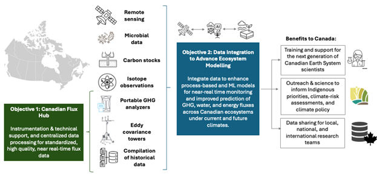

# CanFlux: Coordinated Observations of Ecosystem–Climate Interactions Across Canada

CanFlux is a revitalized national network dedicated to measuring and understanding carbon, water, energy, and other exchanges between Canada’s diverse ecosystems and the atmosphere. These complex exchanges, also known as fluxes, are a critical factor in understanding climate change as they help determine the movement of greenhouse gases (GHGs) such as carbon dioxide (CO~2~), methane (CH~4~), nitrous oxide N~2~O), and water vapour (H~2~O).

This is important specifically because human activity is releasing carbon and nitrogen into the atmosphere faster than natural processes can remove it, causing an increase in the global average temperature and the frequency and intensity of extreme weather events such as heatwaves, precipitation, flooding, and droughts. In turn, there is an increased likelihood of longer and more severe wildfire seasons that release large amounts of GHGs into the atmosphere. More severe fires can also prevent forests from recovering fully and cause them to change from carbon sinks to carbon sources. 
Since Canadian ecosystems play a vital role in regulating the climate [by exchanging CO~2~, CH~4~, and N~2~O] across natural and managed forests, wetlands, croplands, grasslands, and urban green space, it is crucial to continue monitoring these changes that are impacting the carbon and water cycles.

## How can CanFlux help?
Ecosystem fluxes are commonly measured by installing instrumentation on “flux towers” (Figure 1) which tracks GHGs, temperature, and winds, ideally over annual to decadal timescales.

{target="_blank"} project at (a) Lac-à-la-Tortue, QC (wooded natural bog); (b) Lac Saint-Pierre, QC (disturbed marsh); (c) Lac-à-la-Tortue, QC (open natural bog).](./images/flux_tower_examples.png){fig-align="center"}

This observed flux data can be used in many ways; to determine whether ecosystems are sources or sinks of carbon, and whether this changes over time; towards estimations of GHG concentrations in the atmosphere; towards government mandated reporting of GHG emissions; and to help develop and improve models predicting the future climate, to name an important few.

:::{.callout-tip title="CanFlux Goals"}
* `CanFlux will provide the data and tools needed to track ecosystem responses to climate change, improve predictive models, and guide risk mitigation and sustainable management decisions.`

    By integrating flux tower measurements, ground observations (e.g., using alternative measurement methods for carbon and water), remote sensing by satellites, and modelling.

* `CanFlux will strengthen Canada’s resilience and our capacity to anticipate and adapt to climate-related risks while advancing its climate goals through open, high-quality, and policy-relevant environmental observations.`

    Rooted in collaboration among Canadian scientists, federal and provincial governments, Indigenous partners, NGOs, and the private sector.

* `CanFlux aims to enhance efforts to track GHG fluxes and advance Indigenous-led stewardship, nature-based climate solutions, carbon markets, and climate policy.`

    While Canada has a strong legacy of eddy covariance flux measurements, national coordination has waned since the end of [Fluxnet-Canada](https://www.earthdata.nasa.gov/data/catalog/ornl-cloud-fluxnet-canada-1335-1){target="_blank"} in 2014. As a result, valuable datasets remain underutilized due to fragmented infrastructure and limited long-term support.
:::

<!-- ## History of Canadian Flux Networks -->
<!-- Despite decades of scientific leadership, beginning with the pioneering [BOREAS](https://agupubs.onlinelibrary.wiley.com/doi/abs/10.1029/97JD03300){target="_blank"} experiment in the 1990s, continuing with [BERMS](https://water.usask.ca/berms/index.php){target="_blank"} in 1997, then Fluxnet-Canada, and more recently the [Canadian Carbon Program](https://www.sciencedirect.com/science/article/pii/S0168192312002109){target="_blank"}, Canada’s ecosystem–atmosphere monitoring capacity remains fragmented. These foundational programs established national benchmarks for flux science, produced long-term datasets that transformed understanding of temperate and boreal carbon and water cycling, and built a connected community of climate scientists, modellers, and technicians.  -->

<!-- BOREAS and Fluxnet-Canada were concentrated largely south of 60°N, reflecting the technological limitations of the time; earlier instruments required high power, intensive maintenance, and year-round staffing that [made Arctic deployment impractical](https://bg.copernicus.org/articles/9/3185/2012/){target="_blank"}. Recent advances in low-power, low-maintenance sensors now make long-term flux measurements feasible in remote and northern environments, opening the possibility of monitoring previously inaccessible regions that are among the most climate-sensitive in Canada. -->

## Recent Efforts and Ongoing Challenges
Since Summer 2025, in an effort to begin rebuilding a Canadian flux network, [148 historic and active flux sites](https://rshiny.geog.mcgill.ca/knox/canflux/){target="_blank"} have been identified across the country, representing at least 9 different ecosystems (Figure 2).

  <iframe src="https://rshiny.geog.mcgill.ca/knox/canflux/" title="Processes" scrolling="yes" frameborder="0"
    style="border: 0;
   height: 100%;
   left: 0;
   position: absolute;
   top: 0;
   width: 100%;">
   
Your browser does not support iframes.

 </iframe>

 <a href="https://rshiny.geog.mcgill.ca/knox/canflux/" target="_blank">View data visualization in separate window</a>
 
{target="_blank"}](./images/distribution_flux_sites_canada.png){fig-align="center"}

Although new regional and domain-specific initiatives - such as [CARBONIQUE](https://carbonique.ca/en/){target="_blank"} in Quebec, [CanN2Onet](https://cann2onet.org/){target="_blank"} for nitrous oxide fluxes, and [Can-Peat](https://uwaterloo.ca/can-peat/){target="_blank"} for peatland carbon cycling - are advancing important components of this national picture, Canada still lacks a coordinated, pan-Canadian flux network to represent and conserve this valuable resource. 

All the sites are maintained primarily through individual research programs, each relying on heterogeneous instrumentation, metadata standards, and data-processing pipelines. Long-running time series remain vulnerable to loss due to precarious funding, limited technical capacity, and the absence of a national framework to support long-term data stewardship and interoperability. 

Because flux sites across Canada currently operate with disparate instrumentation, uneven ecosystem representation (Figure 2), and limited long-term data support, producing integrated, policy-relevant assessments of terrestrial and aquatic GHG, water, and energy fluxes remains challenging. Many principal investigators are willing to share their data; nearly 70 sites already have data stored in [Ameriflux](https://ameriflux.lbl.gov/data/aboutdata/){target="_blank"}. 

However, a lack of coordinated infrastructure, time, and technical capacity means that fewer than half of Canadian flux tower sites provide open, standardized datasets, leaving valuable time series inaccessible for synthesis or model integration. Additionally, we can no longer rely on previously strong alliances with international partners, making Canadian climate data sovereignty more important than ever.

<!-- ## Solutions -->
<!-- CanFlux will apply consistent approaches to quality control, gap-filling, and flux partitioning allowing comparability across sites and increasing their value for national inventories, remote-sensing validation, and ecosystem modelling. Moreover, sustained financial support for long-term data curation means essential observations are less vulnerable to loss due projects ending, funding lapses, or staff transition - significantly reducing the risk to Canada’s national monitoring capacity. -->

<!-- {fig-align="center"} -->