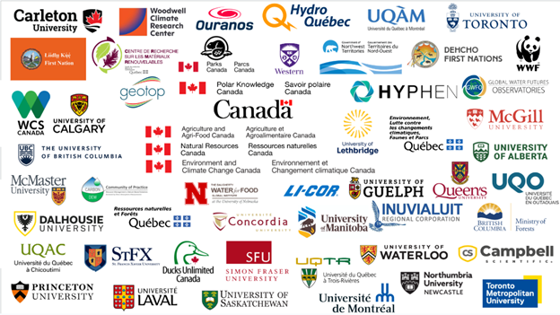

{fig-align="center"}

Un grand merci à <a href="https://www.linkedin.com/company/mcgillmssi/" target="_blank">McGill Sustainability Systems Initiative (MSSI)<a> pour son soutien à l'atelier inaugural CanFlux grâce à sa subvention Catalyseur. Cet atelier a réuni des chercheurs, des scientifiques du gouvernement, des intervenants du secteur privé, des représentants autochtones et des décideurs politiques pour co-développer CanFlux – un réseau national revitalisé d'observation des flux de GES. Merci à tous les participants! Et merci aux co-organisateurs [Sara Knox](https://www.linkedin.com/in/sara-helen-knox/){target="_blank"}, [Scott J. Davidson](https://www.linkedin.com/in/scott-j-davidson-8107076a/){target="_blank"}, [Oliver Sonnentag](https://www.linkedin.com/in/oliver-sonnentag-46b6335/){target="_blank"}, [Michelle Garneau](https://www.linkedin.com/in/michelle-garneau-6083bb2/){target="_blank"}, [Rosie Howard](https://www.linkedin.com/in/rosie-howard-79463bb6/){target="_blank"}, Martina Schlaipfer, et [Evan Henry](https://www.linkedin.com/in/evan-henry-25329ab5/){target="_blank"}.

Cet atelier a mobilisé une vaste communauté de chercheurs, de partenaires autochtones, d'organismes gouvernementaux, d'ONG et d'organisations du secteur privé afin d'élaborer conjointement une vision commune des mesures des flux entre l'écosystème et l'atmosphère au Canada. L'atelier de coordination de CanFlux, qui s'est tenu les 8 et 9 octobre 2025 à Montréal, a constitué une première étape importante de ce processus, réunissant plus de 120 participants (environ la moitié en personne et l'autre moitié en ligne) pour définir les priorités d'un réseau national de mesure des flux scientifiquement rigoureux, opérationnellement viable et mené en partenariat avec les Autochtones. Les participants ont cerné les principaux besoins scientifiques et politiques, évalué les besoins en infrastructure, en données, en formation et en main-d'œuvre, et exploré les options de financement et de gouvernance à court, moyen et long terme.

{fig-align="center"}